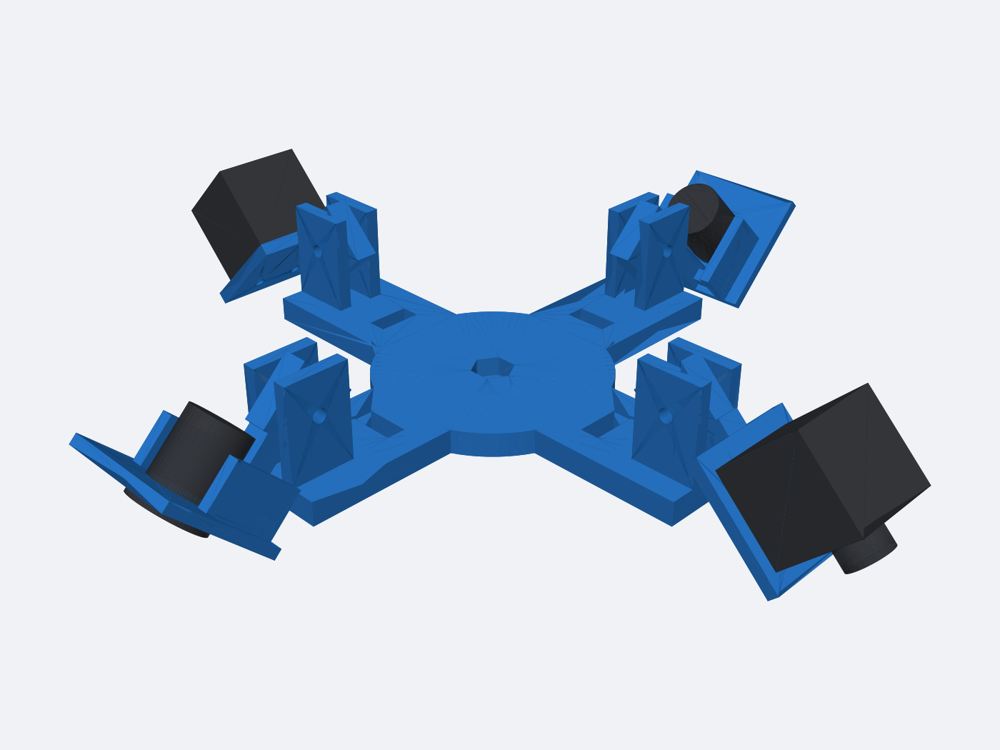

# Four-Camera Tripod Rig

This is a first-revision, 3D-printable surround-camera fixture for:

- Two TechNexion `VLS-GM2-AR0234-C` enclosed GMSL2 cameras.
- Two RAAYOO `L002`-style 18.5 mm flush-mount analog cameras.
- The Amazon Basics `WT3130T+WT3111H` tripod and quick-release plate.

The hub places four pivot axes at 90-degree intervals. Install the two matching
TechNexion cameras opposite each other and the two analog cameras on the other
pair. Each carrier has an M4 friction pivot so all four optical axes can be
aimed outward and downward through a checked 0-60 degree range. Start at
approximately 45 degrees below horizontal, then adjust each camera until it
sees both complete calibration targets on its side. Do not force a carrier
beyond 60 degrees against the hub.



## Print First

Print these small coupons before committing to the complete hub:

1. `generated/analog_fit_coupon.stl`: holes are 18.5, 18.8, and 19.1 mm from
   left to right. Use the smallest opening into which the camera and supplied
   spring clip snap securely. The carrier defaults to 18.8 mm.
2. `generated/tripod_nut_fit_coupon.stl`: verifies the captured 1/4-20 nut and
   tripod quick-release screw fit.

Change `ANALOG_PANEL_HOLE` or `TRIPOD_NUT_ACROSS_FLATS` in
`generate_camera_rig.py` if a coupon indicates that your printer needs a
different allowance.

## Parts To Print

| File | Quantity |
| --- | ---: |
| `generated/tripod_hub.stl` | 1 |
| `generated/technexion_carrier.stl` | 2 |
| `generated/analog_flush_carrier.stl` | 2 |
| `generated/analog_fit_coupon.stl` | 1 initially |
| `generated/tripod_nut_fit_coupon.stl` | 1 initially |

The carrier STLs are already rotated onto a strong, support-minimizing side.
The STEP files retain their assembly coordinate systems for CAD modification.
Do not print files containing `assembly` or `preview` in their names.

Recommended starting settings:

- PETG or ASA. Avoid PLA for a rig that may sit in a hot vehicle or sunlight.
- 0.20 mm layers.
- At least 4 walls and 5 top/bottom layers.
- 35-45 percent gyroid or cubic infill.
- Supports from the build plate only if your slicer finds unsupported details.

The 4.4 mm horizontal pivot bores are intentionally printable without trapped
support. Clear any first-layer or bridge sag with a 4.5 mm drill before
assembly; do not enlarge the camera mounting holes.

## Hardware

- 1 standard steel 1/4-20 hex nut for the tripod interface.
- 4 M4 x 30 mm bolts, 8 washers, and 4 wing nuts or nyloc nuts for the pivots.
- 4 M3 x 6 mm socket screws for the two TechNexion cameras.
- The two analog cameras' supplied flush-mount spring clips.
- Small cable ties for the four strain-relief slots in the hub.

The TechNexion enclosure's threaded holes are only 3 mm deep. With the 4 mm
carrier shelf, an M3 x 6 mm screw engages about 2 mm. Do not substitute a screw
that can bottom out in the camera. Use the two M3 holes on the top or bottom;
the four M2 screws on the lens face retain the lens assembly and are not used
by this fixture.

## Assembly

1. Insert the 1/4-20 nut into the hex pocket from the top of the hub.
2. Fasten the tripod quick-release plate into that nut from below.
3. Put each carrier tongue between one pair of hub ears and install an M4 pivot
   bolt, washers, and a hand-adjustable nut.
4. Mount TechNexion cameras using the two documented bottom M3 holes, with the
   lenses facing away from the hub and FAKRA connectors toward the hub.
5. Snap each analog camera into an analog carrier using its spring clip, with
   its cable routed inward.
6. Put TechNexion carriers on opposite arms and analog carriers on the other
   opposite arms. Secure cables through the hub slots without loading the
   connectors.
7. Level the tripod, set all camera rolls consistently, and tighten the pivots
   only after every camera can see the required targets.

## Design Assumptions

- Tripod interface: 1/4-inch quick-release screw, implemented as a captured
  1/4-20 metal nut.
- TechNexion body: 29.5 x 29.5 x 28 mm; bottom mounting holes are M3 x 0.5,
  15 mm center-to-center, 3.8 mm behind the front face, and 3 mm deep.
- Analog body: 23 mm front flange, 18.5 mm rear body/panel opening, and 23 mm
  depth. The default printed opening adds 0.3 mm clearance.
- Hub envelope: 160 x 160 mm. The tripod's published 2 kg capacity is well
  above the four cameras and printed fixture, but keep the center column as low
  as practical for calibration stability.

Measure the first printed parts before treating this as a production fixture.
Amazon products can receive silent mechanical revisions even under the same
listing.

## Dimension References

- [TechNexion VLS-GM2-AR0234 product brief](https://www.technexion.com/wp-content/uploads/2025/12/product-brief-vls-gm2-ar0234-sl.pdf)
- [RAAYOO L002-U1 flush-mount dimensions](https://raayoo.com/products/l002-u1-wt-ahd-720p-backup-camera)
- [Amazon Basics B00XI87KV8 tripod manual](https://manuals.plus/asin/B00XI87KV8.pdf)

## Regenerate

CadQuery 2.7 or newer is required:

```sh
python3 -m venv .venv
.venv/bin/pip install cadquery
PATH="$PWD/.venv/bin:$PATH" ./generate.sh
```

The generator validates that each printable part is one connected, valid
solid and checks both carrier and camera-envelope clearance from 0 through 60
degrees. It then writes STL, STEP, assembly preview, and dimension reports
under `generated/`.
