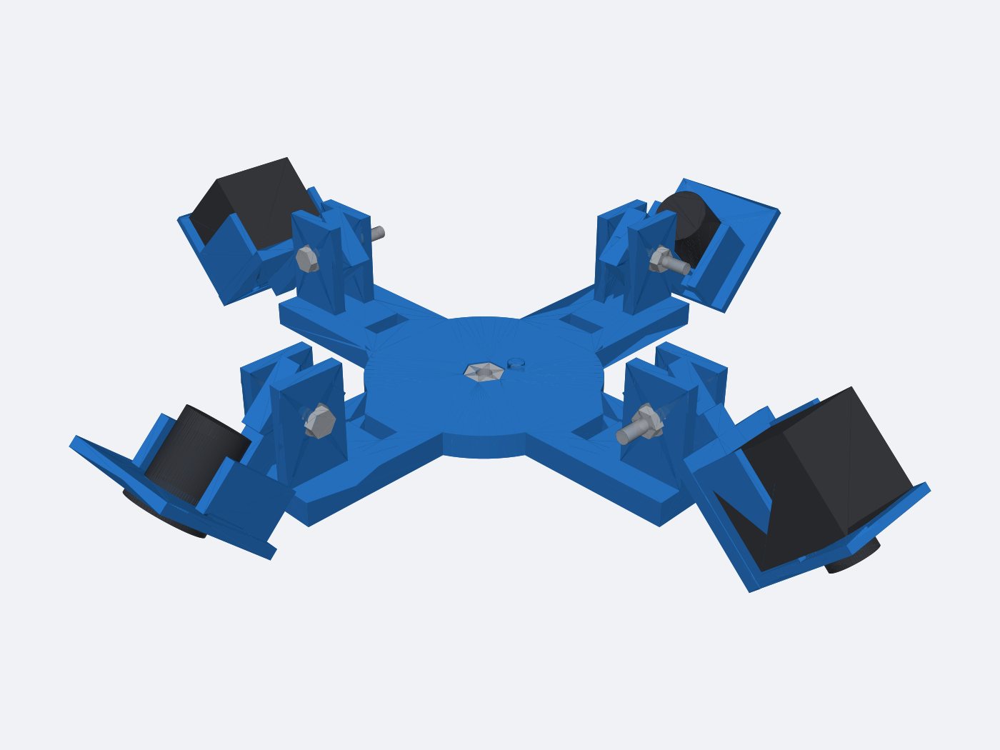

# Four-Camera Tripod Rig V2

V2 extends the [frozen v1 design](../v1/README.md) for the same camera set:

- Two TechNexion `VLS-GM2-AR0234-C` enclosed GMSL2 cameras.
- Two RAAYOO `L002`-style 18.5 mm flush-mount analog cameras.
- The Amazon Basics `WT3130T+WT3111H` tripod and quick-release plate.

The four carriers remain arranged at 90-degree intervals, with matching camera
types opposite each other. V2 adds indexed aiming, screwless TechNexion
retention, the tripod's anti-rotation pin interface, and hardware references in
the CAD assembly.



## V2 Changes

- Spherical detents at 0, 15, 30, 45, and 60 degrees below horizontal.
- A 5.2 mm diameter by 5.2 mm deep blind tripod lock-pin hole, 14 mm from the
  1/4-20 screw center as specified by ISO 1222.
- TechNexion side walls and a lens-plane front frame with a 25 mm aperture.
  The original M3 mounting holes remain available.
- Modeled 1/4-20 tripod nut, representative tripod screw and lock pin, and four
  M4 x 30 pivot bolt/washer/nut stacks.

The hardware models omit helical threads and are for assembly/reference only.
Purchase metal hardware; do not print the files containing `reference` or
`preview` in their names.

`generated/tripod_nut_1_4_20.stl` is the exception: it is a standalone,
printable 1/4-20 nut with extra thread clearance for FDM printing. It fits the
hub's captured-nut pocket. Use it for fitting and light stationary use; retain
the standard steel nut for the finished rig.

## Print First

1. Print `generated/pivot_detent_clevis_coupon.stl` and
   `generated/pivot_detent_tongue_coupon.stl`. Assemble them with one M4 bolt
   stack and verify that the five positions click into place without excessive
   force.
2. Print `generated/analog_fit_coupon.stl`. Its openings are 18.5, 18.8, and
   19.1 mm from left to right. Use the smallest secure opening.
3. Print `generated/tripod_nut_fit_coupon.stl`. It checks both the captured
   1/4-20 nut and the tripod's spring-loaded stabilizing pin before committing
   to the full hub.

The stabilizing pin should enter the blind hole without carrying vertical
load. If your particular quick-release plate does not match the ISO position,
measure its pin diameter and center spacing before changing the generator.

## Parts To Print

| File | Quantity |
| --- | ---: |
| `generated/tripod_hub.stl` | 1 |
| `generated/technexion_carrier.stl` | 2 |
| `generated/analog_flush_carrier.stl` | 2 |
| `generated/pivot_detent_clevis_coupon.stl` | 1 initially |
| `generated/pivot_detent_tongue_coupon.stl` | 1 initially |
| `generated/analog_fit_coupon.stl` | 1 initially |
| `generated/tripod_nut_fit_coupon.stl` | 1 initially |
| `generated/tripod_nut_1_4_20.stl` | 1 optional |

The carrier STLs are already oriented for printing. The TechNexion front frame
and analog panel sit on the build plate. STEP files retain assembly coordinates
for CAD modification.

Every arm uses the same tongue interface. Four TechNexion carriers may be
printed and installed instead when the final camera set becomes all-TechNexion.

Recommended starting settings:

- PETG or ASA; avoid PLA for sunlight or hot-vehicle use.
- 0.20 mm layers.
- At least 4 walls and 5 top/bottom layers.
- 35-45 percent gyroid or cubic infill.
- Build-plate-only support if required by the slicer.

Clear any bridge sag from the 4.4 mm pivot bores with a 4.5 mm drill. Do not
enlarge the TechNexion M3 holes, lens opening, or detent pockets.

## Hardware

- 1 standard steel 1/4-20 hex nut.
- 4 M4 x 30 mm bolts, 8 M4 washers, and 4 hand-adjustable or nyloc M4 nuts.
- Optional: 4 M3 x 6 mm socket screws for the two TechNexion cameras.
- The two analog cameras' supplied flush-mount spring clips.
- Small cable ties for the four strain-relief slots in the hub.

The TechNexion enclosure threads are only 3 mm deep. Through the 4 mm shelf,
M3 x 6 mm screws engage approximately 2 mm. Do not use longer screws that can
bottom in the enclosure, and do not use the four M2 lens-face screws.

## Assembly

1. Test the tripod coupon against the quick-release plate, including its small
   spring pin.
2. Insert the 1/4-20 nut into the hub's top hex pocket. Rotate the quick-release
   plate until its lock pin aligns with the blind hole, then tighten its screw
   into the nut from below.
3. Put each carrier tongue between a clevis pair and install its M4 hardware.
4. Loosen the M4 nut slightly, click the carrier into an indexed angle, and
   tighten it. Do not force the detent while fully clamped.
5. Lower each TechNexion camera into its cradle with the lens through the front
   opening and the FAKRA connector toward the hub. Add M3 screws when positive
   retention is required.
6. Snap each analog camera into its panel using the supplied spring clip.
7. Start all four cameras at 45 degrees and adjust until each sees the complete
   calibration targets on its side.

The screwless TechNexion cradle relies on gravity and is intended for a
stationary calibration tripod. It is not positive retention for transport,
inversion, vibration, or operation on a moving boat. Use the M3 screws or an
independent safety restraint in those conditions.

## Design Dimensions

- Hub envelope: 160 x 160 mm.
- Indexed carrier range: 0-60 degrees in 15-degree increments.
- Tripod lock-pin receiver: 5.2 mm diameter, 5.2 mm deep, at 14 mm centers.
- TechNexion cradle: 0.5 mm nominal side/front clearance and 25 mm lens opening.
- TechNexion body reference: 29.5 x 29.5 x 28 mm.
- Analog reference: 23 mm flange, 18.5 mm panel body, and 23 mm depth.

## Dimension References

- [ISO 1222:2010 tripod-connection preview](https://cdn.standards.iteh.ai/samples/55918/c73a7958dcef45ada49bf2fdcc959786/ISO-1222-2010.pdf)
- [TechNexion VLS-GM2-AR0234 product brief](https://www.technexion.com/wp-content/uploads/2025/12/product-brief-vls-gm2-ar0234-sl.pdf)
- [RAAYOO L002-U1 flush-mount dimensions](https://raayoo.com/products/l002-u1-wt-ahd-720p-backup-camera)
- [Amazon Basics B00XI87KV8 tripod manual](https://manuals.plus/asin/B00XI87KV8.pdf)

## Regenerate

CadQuery 2.7 or newer is required:

```sh
python3 -m venv .venv
.venv/bin/pip install cadquery
PATH="$PWD/.venv/bin:$PATH" ./generate.sh
```

The generator validates printable solids, camera/hub clearance at every indexed
angle, and writes STL, STEP, assembly preview, and dimensions under
`generated/`.
